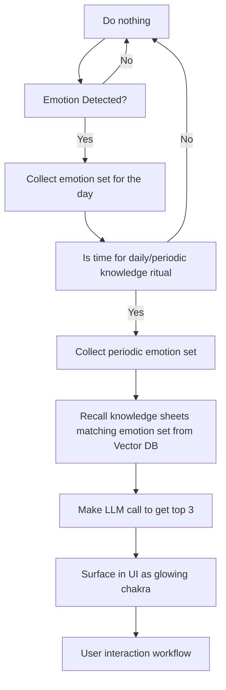

#### Swadhyaya - AI-driven Manana tool

Swadhyaya aims to improve retention among Art of Living graduates by way of periodic/daily knowledge nudges that help them stay connected with the knowledge and Gurudev!

It aims to do that by providing sensing user emotions from data collected using wearables.

The App runs in 4 stages:

1. Data collection from wearable device
2. Signal conversion to emotional states (States of mind)
3. Emotional states conversion to knowledge candidates.
4. Selecting the most appropriate knowledge candidate to nudge the user with.

## Flow diagram

|Chakra|Emotion|
|-----------|-------|
|Sahasraara | Bliss |
| Ajna | Awareness, Anger |
| Vishuddha | Gratefulness, Sadness |
| Anahata | Love, Fear, Hatred |
| Manipura | Joy, Generosity, Jealousy, Greed |
| Swadhisthana | Creativity, Lust |
| Mooladhara | Interest in Life, Depression |
